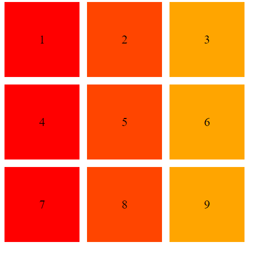

# Grid布局

## 简单探讨一下何时使用Grid布局

首先比对一下我用过flex布局、grid布局、bootstrap 12格栅格、antd组件化 24格栅格的区别

### flex:  

优点：对动态数据友好，响应式布局  
缺点：上手困难；flex嵌套flex后代码不清晰，兼容性差（IE9以下不兼容）

### grid:  
优点：类似表格，但对搜索引擎友好；响应式布局   
缺点：面对动态数据时乏力；需要不停的计算，然后修改css；兼容性差（IE9以下不兼容）

### bootstrap:  
优点：快速使用，不需要撰写布局css  
缺点：过于臃肿，有100kb，有大量的类用不上，得自己优化；响应式布局需用不同的class

### antd等组件库:  
优点：模块化，组件化，按需打包，不需要撰写布局css   
缺点：过于依赖轮子，降智；响应式布局需用不同的api

</br>

综上我认为在不封装自己的组件，不想添加额外读取压力，UI明确的情况下使用grid是比较方便的。
简单的使用场景：两栏布局(30% 70%)，三栏布局(20% 60% 20%)

---

## 一、定义

使用行(Row)和列(Column)进行**二维布局**。

---

## 二、基本使用

我们需要了解一个grid布局的使用流程

---
### 2.1 开启grid布局

`display:grid`用来指定一个容器采用grid布局

这里需要引进一个概念：容器(container)与内容元素(item),我们认为采用grid布局的容器为container，其中 **并列的顶层子元素** 为item

来看个代码

```
<div class="container">   //采用grid布局的父级容器
  <div class="item"></div>  //并列的顶层子元素
  <div class="item"></div>  //并列的顶层子元素
  <div class="item">  //并列的顶层子元素
    <div class="item-children"></div>   //此为祖代子元素，故不由grid布局管理。
  </div>
</div>
```
---
### 2.2 使用row与column制作基础的grid布局

**本节我们会用到以下配置属性：行模板：`grid-template-rows`、列模板：`grid-template-columns`、行间距：`(grid-)row-gap`、列间距：`(grid-)column-gap`、行列间距：`(grid-)gap`** 。   
**本节我们会用到以下关键字：repeat函数自动填满该行：`autofill`、自动调节宽度：`auto`**  。    
**本节我们会用到以下单位：栅格单位：`fr`(fraction片段)**  
**本节我们会用到以下函数：`repeat()`、`minmax()`**。

首先来引进一个概念：**行与列产生单元格**。  
单元格就是我们放置item的位置

我们来看一看如何实现下图所需的grid布局结构
<table width="100%" border="1px" style="text-align:center" >
  <tr style="height:100px">
    <td>单元格1</td>
    <td>单元格2</td>
    <td>单元格3</td>
  </tr>
    <tr style="height:100px">
    <td>单元格4</td>
    <td>单元格5</td>
    <td>单元格6</td>
  </tr>
</table>

我们可以清晰地看出这个布局共有两行，三列，并组成了六个单元格。


我们使用`grid-template-rows`与`grid-template-columns`来分别定义grid布局中的行与列。  
我们使用`row-gap`与`column-gap`还有`gap`来分别定义grid布局单元格之间的行间距、列间距、行与列间距
```
grid-template-rows:100px 100px //创建两行，每行100px高
grid-template-columns:200px 200px 200px // 创建三列，每列100px宽
gap:10px //行间距与列间距均设置为10px
```


虽然我们成功绘制了一个grid布局的页面，但是可以明显看出这种写法很麻烦，若有200行，岂不是要写200个xxxpx？
于是使用`repeat()`函数

```
grid-template-rows:repeat(200,100px)  //repeat(arg1:重复次数,arg2:重复的值)
```
应当注意的是：  
第二个值可以是多行或者多列
```
grid-template-columns:repeat(3,50px 40px 50px)
```


不过有时单元格的大小是固定的，但是容器的大小不确定，如果希望一行能尽可能多地容纳单元格，就需要使用 `autofill` 关键字。

**注意！该关键字只在`grid-template-columns`中有效**

```
grid-template-columns:repeat(autofill,100px);
grid-template-rows: repeat(2,150px);
gap:10px
```


---

#### **响应式布局**

到这步我们如愿地绘制了一些按照尺寸需求的页面，不过问题在于有的时候我们需要绘制一些响应性的页面，直接写百分比，似乎还要计算间距，这十分地令人苦恼，但是不用着急，grid布局为我们准备了一个数据单位。  

`fr` , fraction , 意为片段 ，它会将行分为width相同的n fr份,再根据列设定的fr数，来分配宽度

```
grid-template-columns:1fr 2fr 3fr
```


---

同时 `fr` 可以与绝对长度单位一同使用

```
grid-template-columns:250px 1fr 2fr
```


有时或许我们只希望某几个单元格有响应式布局的效果，可以使用 `minmax()` 函数来定制一个长度范围

```
grid-template-columns: 1fr 1fr minmax(100px, 1fr);
```
看看效果：


</br>


如果我们希望某个单元格由浏览器自己决定长度，可以使用 `auto` 关键字,浏览器会默认使使用auto关键字的单元格呈最大宽度。如果单元格元素设定了`min-width`，那么该单元格可以看作minmax(min-width,当前浏览器所剩的最大宽度)

```
div-2{
  background-color: orangered;
  min-width: 500px
}

.wrapper-auto{
  display: grid;
  gap: 10px;
  text-align: center;
  grid-template-rows: repeat(1,150px);
  grid-template-columns: 100px auto 100px
}
```
看看效果：


</br>


### 2.3 grid布局的排列方法

在最开始的grid使用时机中，我有提到grid布局有点像在使用table。既然像table，grid布局也就一定有合并单元格的方法。  
我们使用属性 `grid-template-areas` 来命名每个单元格，用属性`grid-column-start`、`grid-column-end`、`grid-row-start`、`grid-row-end`可以合并单元格。  
看代码：

```
.container{display : grid;
grid-template-columns : 200px 200px 200px 200px;
grid-template-rows : 100px 100px;
}

.div1{
  background:red;
  grid-column-start : 1 ;
  grid-column-end : 3 ;
}
```


我们可以通过chrome调试工具看见我们的div1占据了一列的两格，但是 `grid-column-start` 与 `grid-column-end` 中的值代表着什么呢？

此处我们要引进一个新的概念：**网格线**

grid布局是一种二维布局，一个矩形有什么？两条竖线，两条横线。所以要确认一个单元格，我们需要两条行网格线，两条列网格线。

在grid布局中，网格线的index值，在从左向右或者从上向下的顺序时由1开始，在从右向左或者从下向上的顺序时由-1开始。

---
使用以上的方法的确能够得到合并的单元格，不过还是不够灵活，每次都要计算网格线或者跨几个单元格。有没有一种方式，能让我们在grid布局中，自由的定义每个单元格做什么呢？

先引进一个概念：**area**

在grid布局中，由一个或者多个单元格定义的范围被称为area

我们在container中使用 `grid-template-areas` 属性来定义area  
我们在item中使用 `grid-area` 来定义该item属于哪个area

```
.wrapper{
  display:grid;
  grid-template-columns : 200px 200px 200px 200px;
  grid-template-rows : 100px 100px 100px;
  grid-template-areas:"header header header header"
                      "section1 section1 section1 section1"
                      ". section2 section2 section2"  // "." 代表该单元格不被使用
}

.div1{
  background-color:red;
  grid-area : header
}

.div2{
  background-color:oranged;
  grid-area : section1
}

.div3{
  background-color:gold;
  grid-area : section2
}

```


在了解了areas概念之后，我们有必要开始学习如何排列grid布局的单元格。  
首先先来看一看单元格的排列顺序设置：`grid-auto-flow`  
`grid-auto-flow`有四个值可供选择：`row` 、 `column` 、`row dense`  、 `column dense` , 这和flex布局中的`flex-direction`是相似的，默认值为`row`，即先行再列的排列顺序。  
如下图：


```
.wrapper-row {
  display: grid;
  grid-template-columns: 100px 100px 100px;
  grid-template-rows: 100px 100px 100px;
  gap:10px;
  grid-auto-flow: row;
}
```



当值为 `column` 时，则遵循先列再行的顺序。  
如下图：

```
.wrapper-col {
  display: grid;
  grid-template-columns: 100px 100px 100px;
  grid-template-rows: 100px 100px 100px;
  grid-auto-flow: column;
  gap:10px
}
```


以上两种值提供的效果比较循规蹈矩，但如果面临一些独特的需求，比如
我们不希望在一些可以紧凑的grid布局里出现空白，如下图:


使用值 `row dense`

```
grid-auto-flow: row dense;
```

发现单元格被填上了


---
对齐->container ->item -> self

 容器以何种方式对齐 
 ```
  justify-content: start | end | center | stretch | space-around | space-between | space-evenly;
  align-content: start | end | center | stretch | space-around | space-between | space-evenly;  
```
 顶层子元素以何种方式对齐
 ```
 justify-items: start | end | center | stretch;
  align-items: start | end | center | stretch;
 ```

 单个顶层子元素以何种方式对齐
```
  justify-self: start | end | center | stretch;
  align-self: start | end | center | stretch;
```

