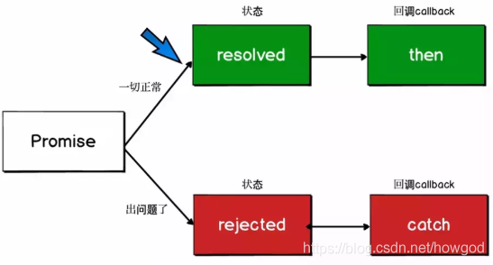
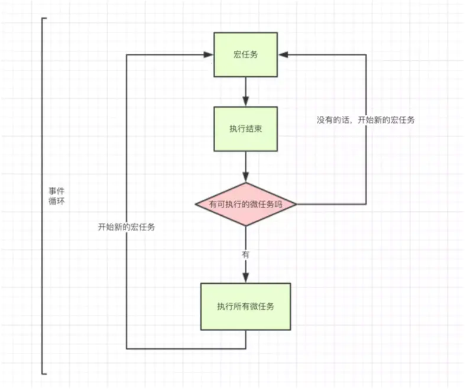

# 异步编程的理解
>*Javascript*是单线程循环模型  
优势：便于操作，执行环境单纯  
劣势：程序按需执行，容易因前一任务耗时过长或者死循环，导致整个程序卡死
## 同步与异步
>同步行为对应内存中顺序执行的处理器指令，每条指令严格按照出现的顺序执行，执行后也会立即获得储存在系统本地的信息，这样的执行流程有利于分析程序执行到相应代码处的状态

>异步行为就是延迟处理，在HTML交互中常会出现IO操作（即input/output），比如AJAX或者脚本文件加载，通过异步函数来实现。  
异步编程实例：回调函数、事件、发布订阅、promise、AJAX

### 1.回调函数
```
function eat() {
    console.log("好的，我来吃啦！")
}

function cook(callback) {
    console.log("妈妈认真做饭");
    setTimeout(function () {
        console.log("来吃饭吧！");
        callback();
    }, 1000)

}

function read(){
    console.log("我在认真读书");
}

cook(eat);
read();

/* 执行顺序：
妈妈认真做饭
我在认真读书
来吃饭吧！
好的，我来吃啦！
*/

```

>这种异步处理不能使用 try catch 捕获错误，不能直接 return。  
优势：简单、容易实现  
劣势：不便维护，高度耦合，回调地狱，而且每个任务只能指定一个回调函数。

### 2.事件监听
```
f1.on('done',f2)
function f1(){
    setTimeout(function(){
        f1.trigger('done')
    },1000)
}

```
>这种方式下，异步任务的执行不取决于代码的顺序，而取决于某个事件是否发生。
优势：容易理解，可以绑定多个事件，便于模块化   
劣势：是整个程序都要变成事件驱动型，运行流程会变得很不清晰。阅读代码的时候，很难看出主流程。

### 3.发布订阅
>我们假定，存在一个"信号中心"，某个任务执行完成，就向信号中心"发布"（publish）一个信号，其他任务可以向信号中心"订阅"（subscribe）这个信号，从而知道什么时候自己可以开始执行。这就叫做"发布/订阅模式"（publish-subscribe pattern），又称"观察者模式"（observer pattern）。

```
function f1(){
    setTimeout(function(){
        //...
        jQuery.publish("done")
    },1000)
}

jQuery.subscribe("done",f2)

```
>上面代码中，jQuery.publish(‘done’)的意思是，f1执行完成后，向信号中心jQuery发布done信号，从而引发f2的执行。f2完成执行后，可以取消订阅（unsubscribe）

### 4.promise

#### 1) Promise的三种状态
- Pending----Promise对象实例创建时候的初始状态
- Fulfilled----可以理解为成功的状态
- Rejected----可以理解为失败的状态



##### *改变Promise状态的方式*
- 1. resolve函数    pending => fulfilled
- 2. reject函数      pending => rejected
- 3. throw            pending => rejected

##### *一个promise在改变状态时会调用相应状态的回调函数*

#### 2) Promise对象的值
- 实例对象中的一个属性 [PromiseResult] 保存着*异步任务*成功或者失败的结果
* resolve
* reject
 
#### 3) Promise then和catch回调
- then()和catch()方法属于Promise实例的方法
- then()回调resolve和reject的结果
- catch()回调reject的结果

> catch()方法案例
```
let p = new Promise((resolve,reject)=>{
    reject("error")
});

p.catch(reason=>{
    console.log(reason)
})
```

#### 4) Promise resolve()方法
- resolve()方法属于Promise本身的对象的方法
- resolve()方法封装一个value作为值，并且返回一个成功/失败的Promise对象
*  此处的resolve()方法与resolved状态不是同一事物

> resolve()方法案例
```
// 如果传入参数为非Promise对象，则返回结果为成功Promise对象
let p1 = Promise.resolve(200);
console.log(p1);    // PromiseState:fulfilled , PromiseResult:200

// 如果传入参数为Promise对象，则参数的结果决定了resolve()的结果
// * fulfilled
let p2 = Promise.resolve(new Promise((resolve,reject)=>{
    resolve('p2-success')
}));
console.log(p2);    // PromiseState:fulfilled ,PromiseResult:p2-success
//  * rejected
let p3 = Promise.resolve(new Promise((resolve,reject)=>{
    reject('p3-error')
}));
p3.catch(reason=>{
    console.log(p3);    // PromiseState:rejected , PromiseResult:error
})
```

#### 5) Promise reject()方法
- reject()方法属于Promise本身的对象的方法
- reject()方法封装一个reason作为值，并且返回一个失败的Promise对象
- reject()方法即使传一个成功的Promise对象进来依旧会返回一个失败的Promise对象

> reject()方法案例
```
//非Promise对象
let p = Promise.reject(200);

p.catch(reason => {
    console.log(p);     //PromiseState:rejected , PromiseResult:200
    console.log(reason); //200
})
//Promise对象
let p1 = Promise.reject(new Promise((resolve, reject) => {
    resolve(300);
}))

p1.catch(reason=>{
    console.log(reason);    //PromiseState:rejected , PromiseResult:300
    console.log(p1); //PromiseState:rejected , PromiseResult:PromiseState:rejected , PromiseResult:300
})
```

#### 6) Promise all()方法
- all()方法属于Promise本身的对象的方法
- all()方法封装一个promises作为值，promises是一个包含了数个promise的数组
- 返回一个新的promise，只有所有的promise都成功才能成功。返回的值是所有promise的值

> all()方法案例
```
let p1 = new Promise((resolve,reject)=>{
    resolve("p1.ok")
});
let p2 = Promise.resolve("p2.ok");
let p3 = Promise.resolve("p3.ok");
const result = Promise.all([p1,p2,p3]);
console.log(result)         //[[PromiseResult]]: Array(3) ,0: "p1.ok", 1: "p2.ok", 2: "p3.ok" length: 3
```

#### 7) Promise race()方法
- race()方法属于Promise本身的对象的方法
- race()方法封装一个promises作为值，promises是一个包含了数个promise的数组
- 返回一个新的promise，第一个完成的promise的状态和值就是返回的promise的状态和值

> race()方法案例
```
let p1 = new Promise((resolve, reject) => {
    resolve("p1.ok")
});
let p2 = Promise.resolve("p2.ok");
let p3 = Promise.resolve("p3.ok");
const result = Promise.race([p1, p2, p3]);
console.log(result) //"p1.ok"

let p4 = new Promise((resolve,reject)=>{
setTimeout(()=>{
resolve("p4.ok")
},1000)
});
let p5 = Promise.resolve("p5.ok");
let p6 = Promise.resolve("p6.ok");
const result2 = Promise.race([p4,p5,p6]);  
console.log(result2) //"p5.ok" 
```

#### 8) promise链的异常穿透
- 当使用promise的then链式调用时，可以在最后指定失败的回调。
- 前面任何操作出现了异常，都会传到最后失败的回调中处理。

#### 9) 中断promise链
> 有且只有一种方法：
```
return new Promise(()=>{})
```
> promise链由then()方法串联，当promise的状态改变时，进行下一步，由于return了一个pending状态的promise，状态不再改变，因此promise链中断。

#### 10) async函数
- 1.函数的返回值为promise对象
- 2.promise对象的结果由async函数执行的返回值的结果决定
> 如果函数内返回值是一个非Promise类型的数据，则promise对象结果为fuifilled  
如果函数内返回值是一个Promise类型的数据，则返回的promise对象的结果取决于函数内返回的promise对象的结果  
如果函数内抛出错误，则于函数内返回一个reject相同

#### 11) await 表达式
- 1.await右侧的表达式一般为promise对象，但也可以是别的值 
- 2.如果表达式是promise对象，await返回的是promise成功的值
- 3.如果表达式是其他值，直接将此值作为await的返回值
- *await必须写在async函数里，单是async函数里可以没有await*
- *如果await的promise失败了，就会抛出异常，需要用try...catch...来捕获*


## macro-task(宏任务)与micro-task(微任务)

* macro - task(宏任务):包括整体script代码,setTimeout,setInterval

*  micro - task(微任务):promise的then、catch、finally方法,process.nextTick

*按照这种分类方式,JS 的执行机制是:*
* 执行一个宏任务,过程中如果遇到微任务,就将其放到微任务的[事件队列]里
* 当前宏任务执行结束后,会查看微任务的[事件队列],并将里面全部的微任务依次执行完
重复执行以上两步,结合event loop(1) 和 event loop(2) 就是更为准确的 JS 执行机制了



 ```
setTimeout(() => console.log("代码开始执行"),0);        // 4
new Promise((resolve,reject) => {
console.log("开始for循环");     //1
resolve();
}).then(() => console.log("执行then函数"))      //3
console.log("代码执行结束");    //2

 ```
 > 宏任务环1：遇到setTimeout ，将其放置于宏任务队列  
 遇到promise，执行其中的executor  
 遇到then方法，放置于微任务队列中  
 执行本环宏任务链最后一个任务  
 event loop(1)结束  
 开始准备宏任务环2  
 查看微任务队列，完成本环微任务    //promise.then()  
 开始宏任务环2
 执行宏任务
  event loop(2)结束