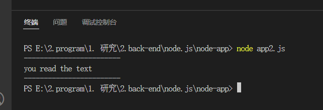

# Node.js

Node.js 是一个开源的，基于 C++ 与 js V8 引擎开发的运行环境，该环境允许用户在浏览器外运行Javascript。

单线程single process , 异步的asynchronous , 非阻塞I/O non-blocking paradigms

## 1.Node.js与浏览器的区别

### 生态环境不同
在浏览器中可以操作DOM与Web平台api进行交互   
Node中没有document、window等浏览器对象

---

### 版本自由度不同
浏览器不能灵活地切换版本   
Node可以自由切换版本   
**这意味着：浏览器需要使用Babel来维护兼容性；Node不需要。**

---

### 模块系统不同
浏览器使用ES Modules  
Node使用CommonJS  
**这意味着：浏览器使用import * from ""；Node使用require()**

---

## 2.使用Node.js启动服务器

以一个本地的http服务器为例：  
我们首先要引入一个基础的服务器框架express，它导出的模块大致是这些东西：
```

exports = module.exports = createApplication;

function createApplication() {
  var app = function(req, res, next) {
    app.handle(req, res, next);
  };

  mixin(app, EventEmitter.prototype, false);
  mixin(app, proto, false);

  // expose the prototype that will get set on requests
  app.request = Object.create(req, {
    app: { configurable: true, enumerable: true, writable: true, value: app }
  })

  // expose the prototype that will get set on responses
  app.response = Object.create(res, {
    app: { configurable: true, enumerable: true, writable: true, value: app }
  })

  app.init();
  return app;
}
```

```
const express = require('express');  //express的路径
const app = express();  //调用express导出的模块

app.get('/',(req,res)=>{
    res.send('Hi！')
})     //向当前路由发送get请求；返回时发送"Hi！"

app.listen(3000, () => {
    console.log(`
    ------------------------------------------------------------------
    listening port:3000
    ------------------------------------------------------------------    
    `)
});     //启动http服务，监听本地端口3000
```
看看效果：   
首先这是发送get请求成功后返回的内容


接着这是启动服务器后，端口控制台返回的内容


---

## 3. 使用Node.js REPL(交互式解释器) 来启动Node终端

在终端中输入指令 `node` 启动Node终端环境

---

### 单行表达式

此处需要明确一下表达式的概念：  
在js中表达式是指能够 **返回值** 的代码。

```
node  //在终端中启动node环境

> 1 + 4 //基本的数学表达式
5

> (function(){return 1})()  // 运行一个匿名函数

```
---

### 储存变量

我们可以在Node终端环境下储存变量
```
node  //在终端中启动node环境
var a = 1 ; //返回undefined，因为没有返回值
a // 1
```  

让我们将储存变量与使用表达式结合一下：
```
node  //在终端中启动node环境

var c = false;

(function(){if(c){return 1}else{return 2}})()   //运行匿名函数，c为true时，返回1；false返回2 。 此处为2

```

---
多行变量
```
$ node
> var x = 0
undefined
> do {
... x++;
... console.log("x: " + x);
... } while ( x < 5 );
x: 1
x: 2
x: 3
x: 4
x: 5
undefined
>
```
... 三个点的符号是系统自动生成的，你回车换行后即可。Node 会自动检测是否为连续的表达式。


---
下划线变量

```
$ node
> var x = 10
undefined
> var y = 20
undefined
> x + y
30
> var sum = _
undefined
> console.log(sum)
30
undefined
>
```

---

## Node异步编程

###  回调函数

Node.js异步编程的基础方法是回调函数  
  
应当注意的是，为了解决大量的并发请求问题，我们可以使用非阻塞地同步运行的方式来

---

首先，创建一个txt文件,myText.txt

```
------------------------
you read the text
------------------------
```

本案例引入了文件读取模块fs
```
var fs = require('fs')

fs.readFile('./myText.txt','utf-8',(err,data)=>{
  if(error) throw error;
  console.log(data)
})

```



但是我们都清楚使用大量回调函数会导致回调地狱，比如这种代码：

```
var fs =  require('fs')

fs.readFile(file1,'utf-8',(err,data)=>{
  if(err) throw err;
  fs.readFile(file2,'utf-8',(err,data)=>{
  if(err) throw err;
  })
})

```
这种时候我们会想到为了解决回调地狱，es6提出了Promise

### Promise

Promise 对象允许将回调函数的嵌套，改为链式调用。

```
const fs = require('fs-readfile-promise'); //导入promise文档读取模块

fs(file1).then(
  data => console.log(data.toString())  
).then(
  ()=> return fs(file2)
).then(
  data => console.log(data.toString())
).catch(
  err => console.log(err)
)

```
可以看见我们将回调地狱转变成了用 `then` 函数的链式调用，并将err在返回rejected状态时一并处理。   
但是使用大量的`then`同样非常麻烦，因此我们可以使用语法糖 `async` 与 `await`

---

### async 与 await

async :   
1)async是用来修饰函数的  
2)修饰后的函数，变成了异步函数；这个函数调用后回返回一个promise对象  
3)该函数内部的return结果，会作为函数调用promise对象的resolve结果  


await:  
1)await必须要出现在async修饰的方法中，否则报错；也就说await不能单独使用  
2)await用来等待一个方法的执行；该方法可以是同步方法也可以是promise；一般用来等待promise的执行  
3)通过使用async…await可以让以前的then或catch回调函数形式，变成同步的做法；让可读性更好  
4）await只能接收到promise的成功的结果，若promise是失败状态，则收不到结果，会报错  
5）不管promise的状态是会更改为成功或者是失败，await都会等待它的执行  

```
const asyncReadFile = async function () {
try{
    const f1 = await readFile('/etc/fstab');
    console.log(f1.toString());
} catch(err){
  console.log(err)
}

  const f2 = await readFile('/etc/shells');
  console.log(f2.toString());
};
```

