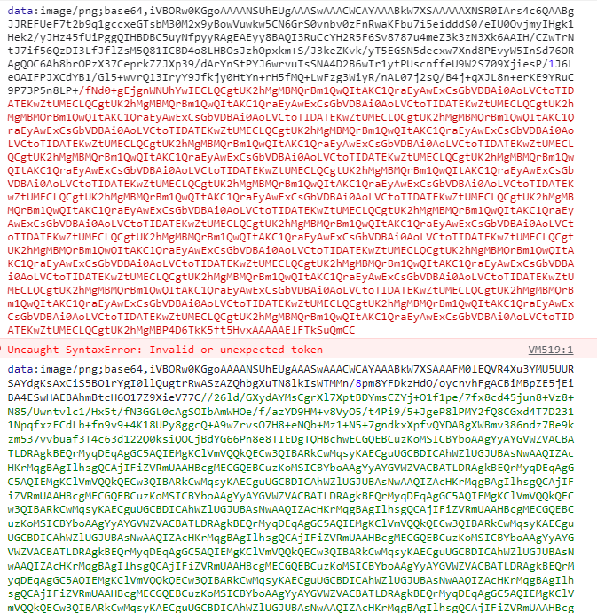

# web网络安全

## canvas 指纹追踪技术

### 时代背景

过去我们使用cookie来追踪用户信息，但是cookie有明显的弊端

- 可以被用户禁止
- 无法跨域访问

或者我们可能会使用浏览器指纹 (navigator)，通过navigator.useAgent属性去查询用户代理信息，通过navigator.language去查询用户浏览器语言设置，通过navigator.platform去查询用户操作系统等。但是navigator也有弊端

- 信息不足，无法进行唯一性标识

### 使用方法

追踪用户调用toDataURL转换base64，获取设备，操作系统，浏览器三合一的唯一标识，重复概率低

尝试一下在不同浏览器中运行这段代码可以在控制台中看见返回的base64码是不同的。
```
    const uuid = () => {
      const canvas = document.createElement('canvas');
      const ctx = canvas.getContext('2d');
      const text = 'test';
      ctx.fillText(text,10,10);
      console.log(canvas.toDataURL());
    };
    uuid();
```

谷歌和火狐的base64码截图如下：



### 防范方法

使用插件为自己生成的canvas中增加肉眼看不见的内容，从而更改canvas base64码

## React —— css键盘记录器
